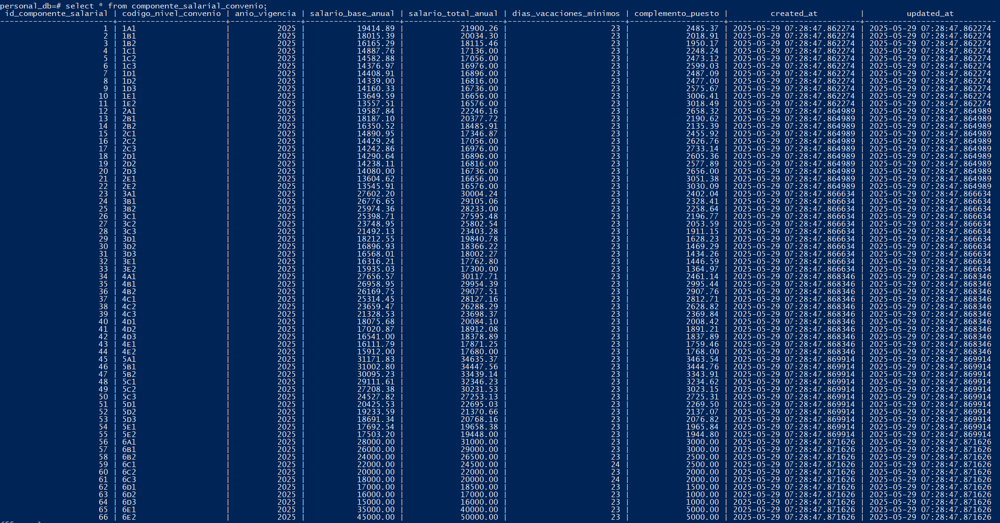

# 3. Diseño e implementación de una base de datos

Se trata de diseñar e implementar una base de datos para la gestión del personal de la empresa. Los requisitos que se deben tener en cuenta son los siguientes:

**🔹 Información de los empleados**

Cada empleado se identifica mediante su DNI, y se debe registrar también su nombre, apellidos, dirección y teléfono.

🔹 **Información de los departamentos**

Los empleados están asignados a un determinado departamento, el cual se identifica con un código único. Además, se almacenará el nombre completo del departamento y su teléfono de contacto.

**🔹 Información de los grupos-nivel**

Cada empleado tiene asignado un grupo-nivel, que se identifica por un código (por ejemplo: A1, B1, etc.). Para cada grupo-nivel, se debe registrar:

- El salario total
- El período de prueba
- Los días de vacaciones

Se adjunta la tabla de los empleados con los datos:

**🔹 Convenio aplicable y requisitos específicos**

Se debe tener en cuenta que, en esta base de datos, se incluirá al menos un empleado por cada grupo-nivel correspondiente al área 2 del convenio "Consultoría, tecnologías de la información y estudios de mercado y de la opinión pública".
Este convenio es uno de los más utilizados en el sector de las Tecnologías de la Información.
A partir del convenio y la tabla salarial actualizada de 2025, se deberá incorporar en la base de datos la siguiente información para cada grupo-nivel:

- Salario total según la revisión salarial de 2025.
- Duración del período de prueba.
- Días de vacaciones anuales.

**Diseño entidad-relación**

**La transformación del modelo a relacional**

Según el convenio colectivo 2025, **XIX Convenio Colectivo Estatal de Empresas de Consultoría, Tecnologías de la Información y Estudios de Mercado y de la Opinión Pública. 
El periódo de prueba de las personas trabajadoras del área 2 es de:** 

**– Área funcional 1 y 2 del Convenio Colectivo:**

● Grupo A: Seis meses.

● Grupo B: Seis meses.

● Grupo C: Cuatro meses.

● Grupo D: Tres meses.

● Grupo E: Tres meses.

Durante el período de prueba la persona trabajadora tendrá los derechos y obligaciones correspondientes a su grupo y nivel profesional y al puesto de trabajo que desempeñe, excepto los derivados de la resolución de la relación laboral, que podrá producirse a instancias de cualquiera de las partes durante su transcurso.

Transcurrido el período de prueba sin que se haya producido el desistimiento, el contrato producirá plenos efectos, computándose el tiempo de los servicios prestados en la antigüedad de la persona en la empresa. Siempre que se haya producido un acuerdo en tal sentido expresado en el contrato de trabajo, las situaciones de incapacidad temporal, nacimiento, adopción, guarda con fines de adopción, acogimiento, riesgo durante el embarazo, riesgo durante la lactancia y violencia de género que afecten al personal durante el período de prueba interrumpirá el cómputo del mismo.

**Área 2. Actividades relacionadas con la atención al usuario, interno y externo**

Esta área incluye las actividades de los centros de atención al usuario (CAU), entendiendo como tal, un servicio externo o interno prestado tanto de manera remota como presencial, en el que se centralizan las peticiones o incidencias, con el objetivo de resolverlas y llevar a cabo un seguimiento de las mismas.
Entre las principales funciones se encuentran, por ejemplo, la atención a las personas usuarias, el registro, categorización, priorización, seguimiento y resolución de incidencias.

**Según el convenio:**

Todas las personas trabajadoras al servicio de las empresas sujetas a este convenio disfrutarán de veintitrés (23) días laborables de vacaciones anuales retribuidas, salvo en el siguiente caso. 

No obstante, se mantendrán las mejoras que las Empresas puedan aplicar las personas trabajadoras que presten servicio en ellas. Por otra parte, las Empresas que disfruten de dos o más meses de jornada intensiva, o bien, que concedan a sus personas trabajadoras el disfrute de dos o más días no laborables, aunque fueren «recuperables», adicionales a los festivos nacionales, autonómicos y locales aplicables, disfrutarán de veintidós días laborables de vacaciones anuales retribuidas.

Las vacaciones se iniciarán siempre en día laborable y terminarán el día inmediatamente anterior de reincorporación al trabajo, salvo en las empresas que tengan establecido un período fijo anual para vacar la totalidad de su plantilla.

### **Tabla salarial actualizada**

