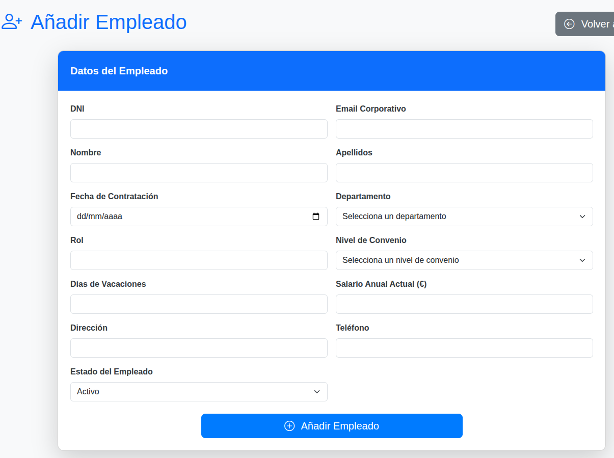
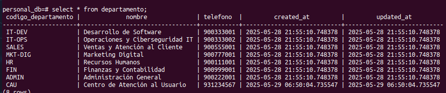
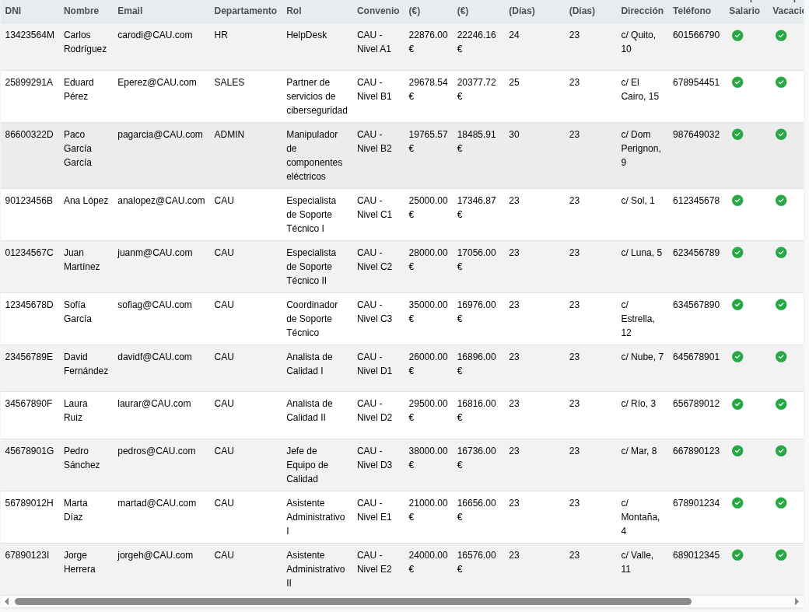
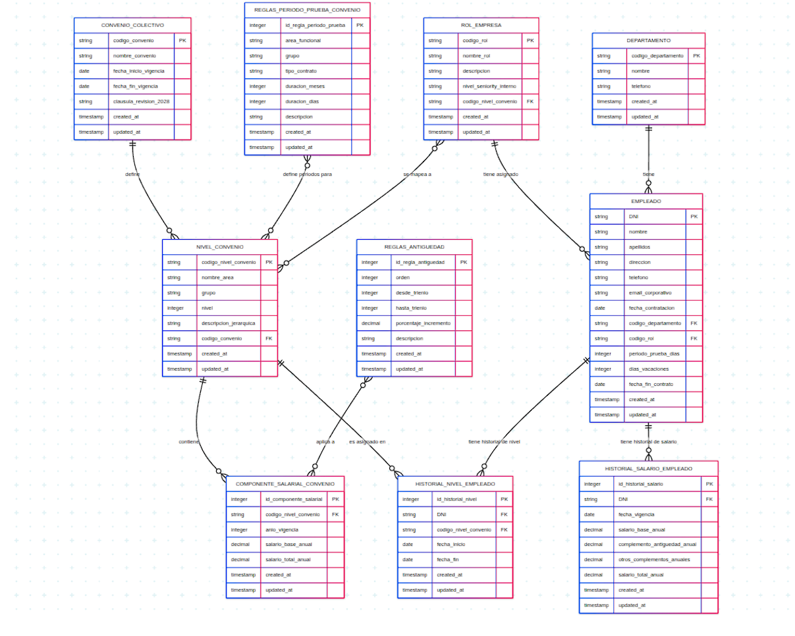

# 3. Diseño e implementación de una base de datos

Se trata de diseñar e implementar una base de datos para la gestión del personal de la empresa. Los requisitos que se deben tener en cuenta son los siguientes:

🔹 Información de los empleados
Cada empleado se identifica mediante su DNI, y se debe registrar también su nombre, apellidos, dirección y teléfono.

🔹 Información de los departamentos
Los empleados están asignados a un determinado departamento, el cual se identifica con un código único. Además, se almacenará el nombre completo del departamento y su teléfono de contacto.

🔹 Información de los grupos-nivel
Cada empleado tiene asignado un grupo-nivel, que se identifica por un código (por ejemplo: A1, B1, etc.). Para cada grupo-nivel, se debe registrar:

El salario total.

El período de prueba.

Los días de vacaciones.

Se adjunta la tabla de los empleados con los datos:

🔹 Convenio aplicable y requisitos específicos
Se debe tener en cuenta que, en esta base de datos, se incluirá al menos un empleado por cada grupo-nivel correspondiente al área 2 del convenio "Consultoría, tecnologías de la información y estudios de mercado y de la opinión pública".
Este convenio es uno de los más utilizados en el sector de las Tecnologías de la Información.
A partir del convenio y la tabla salarial actualizada de 2025, se deberá incorporar en la base de datos la siguiente información para cada grupo-nivel:
Salario total según la revisión salarial de 2025.

Duración del período de prueba.

Días de vacaciones anuales.

CONVENIO COLECTIVO 2025

🔹 Entregables
Se requiere entregar:
El diseño entidad-relación.

La transformación del modelo a relacional.

La implementación en un Sistema Gestor de Bases de Datos (por ejemplo, MySQL, Oracle, etc.).

La introducción de un conjunto significativo de datos reales o representativos.

