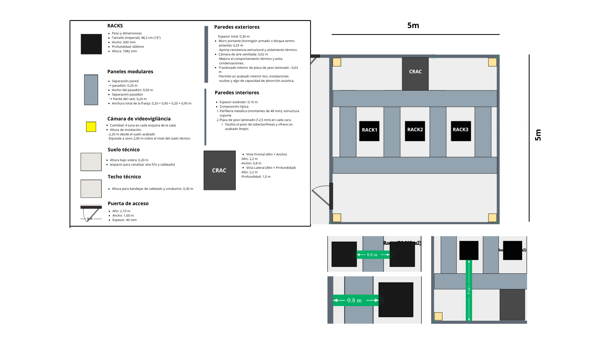
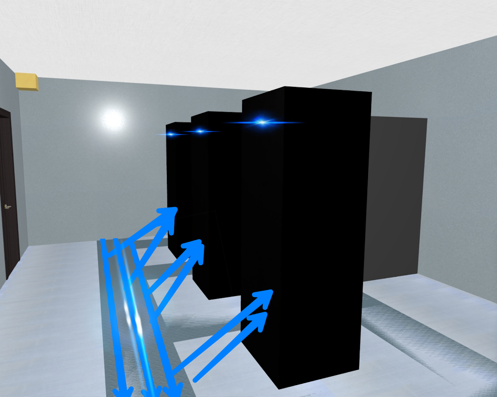
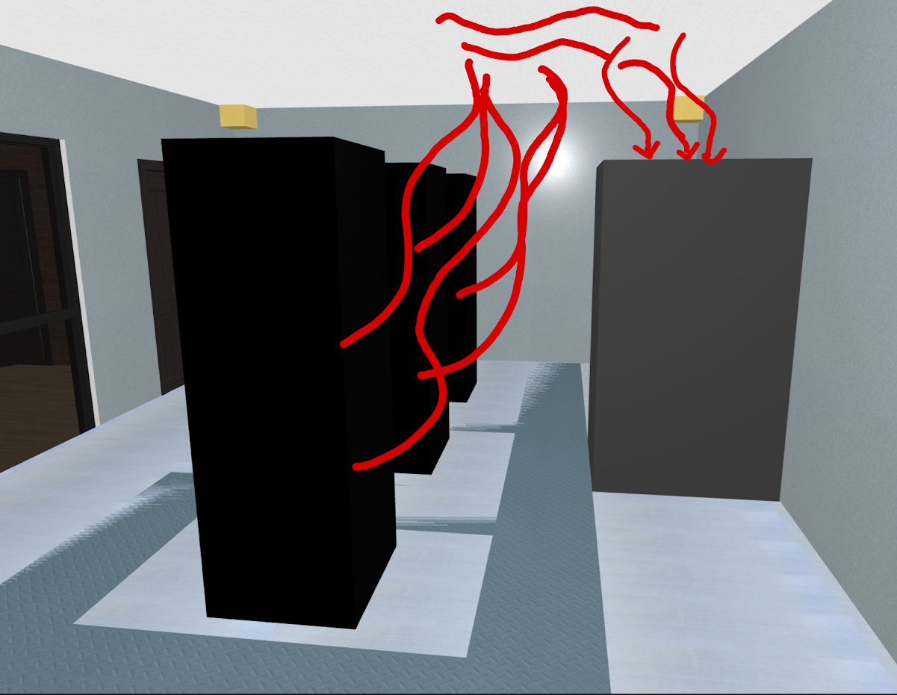
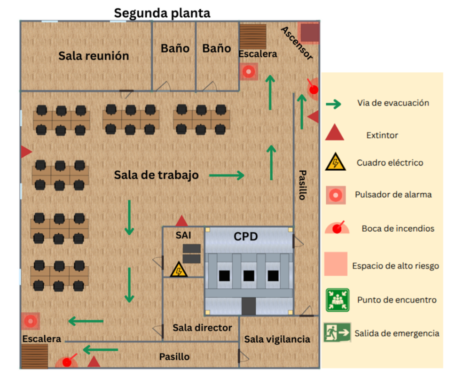

# 1. Propuesta de CPD (Centro de Procesamiento de Datos)

## Ubicación Física
#### Situación física de la sala en el edificio

#### Sistemas de climatización
La temperatura se debe mantener entre 18°C – 27°C
La humedad relativa se debe mantener entre el 40% - 60%

Se implanta un esquema de pasillo frío / pasillo caliente:
El aire acondicionado de precisión (CRAC) inyecta aire frío bajo el suelo técnico hacia el pasillo frío.

El aire frío entra por la parte frontal de los racks, enfría los equipos y sale al pasillo caliente por su parte trasera.

El aire caliente del pasillo caliente es succionado por las tomas de retorno del CRAC (mediante rejillas en falso techo o conductos tras la unidad), se enfría y se recircula al pasillo frío.
Beneficios: evita mezcla de corrientes, minimiza puntos calientes y reduce hasta un 30 % el consumo de refrigeración.

#### Medidas para dificultar la identificación de la sala
La sala que alberga los racks y el RACK de servidores se sitúa en el núcleo interior del edificio, lejos de vestíbulos y accesos principales. No tiene ventanas ni puertas acristaladas; en caso de existir una ventanilla, se aplica un film opaco para impedir la visibilidad. Todas las canalizaciones de red y alimentación eléctrica llegan mediante falsos techos y suelos técnicos, de modo que no sea posible reconocer la función de la sala desde el exterior.

El acceso físico está estrictamente solo para personal autorizado, bajo control de cámaras. No se instalan conductos ni ventiladores aparentes: el aire caliente extraído de los pasillos traseros de los racks se canaliza por conductos internos hasta la unidad CRAC.

De este modo, la sala de refrigeración de precisión y los equipos permanecen discretos, discretamente integrados en la infraestructura, cumpliendo requisitos de confidencialidad, seguridad y eficacia térmica.

#### Distribución y gestión del cableado
El objetivo es garantizar una instalación limpia, eficiente, segura y fácilmente escalable, evitando interferencias, sobrecalentamientos o errores humanos.
1. Canalización separada
Eléctrico y datos en trayectorias distintas:

Canaletas eléctricas en canto de falso suelo.

Bandejas de datos en el techo técnico o railes bajo suelo.

Ventaja: minimiza interferencias electromagnéticas y facilita futuras ampliaciones.

2. Etiquetado claro y uniforme
   
Cada cable lleva etiqueta en ambos extremos con formato:
EJ: srv3 — eth0 — switch1 — port5
Se emplea tipografía legible y película termocontraíble para durabilidad.
Beneficio: agiliza la identificación en incidencias y reduce el riesgo de desconexiones erróneas.

4. Tipos, longitudes y colores
Categoría de cable:
Cat 6a para todos los enlaces de datos (hasta 10 Gbps con margen).

Longitud optimizada:
Evitar cables excesivamente cortos (tensión en conectores) o muy largos (enredos).
Longitud recomendada: 1–3 m en pasillos, 5–7 m para enlaces entre salas.

Código de color en funda o cinta:

Azul → Red de administración
Verde → Red interna entre servidores
Rojo → Tráfico de Internet
Naranja → Backups y almacenamiento

Documentación del cableado
Mapa de red físico y lógico actualizado
Inventario de conexiones con fecha y responsables de la instalación
Tener un cableado ordenado y sin obstáculos mejora la ventilación interna de los racks, ayudando a mantener una temperatura más baja y reduciendo el consumo de energía en refrigeración.

#### Suelo técnico y techo técnico
Debemos optimizar la distribución de cableado, ventilación y accesibilidad del CPD mediante estructuras físicas diseñadas específicamente para entornos de servidores.
Suelo técnico (plenum de aire frío)
Función principal: cámara de distribución de aire frío proveniente de las unidades CRAC hacia el pasillo frío.
Altura del suelo: 0,20 m para canalizar la refrigeración y cableado.
Material: paneles metálicos (aluminio o acero con recubrimiento anti-corrosión) desmontables.
Usos complementarios:
Canalización de cableado de datos (Cat 6a) y fibra, separado de la electricidad.

Pasacables y conductos de alimentación de PDUs desde bandejas superiores.

Ventajas:
- Flujo controlado de aire frío al frente de los racks.
- Acceso rápido al cableado para mantenimiento.
- Refuerzo de la estrategia “cold aisle containment”.
- Techo técnico (plenum de retorno)
- Función principal: rejillas y conductos para extraer el aire caliente del pasillo caliente y conducirlo de vuelta a los CRAC.
- Altura libre bajo techo: 0,30 m para bandejas y tuberías.
- Material: perfiles metálicos y placas ligeras (aluminio o chapa galvanizada).
- Usos complementarios:
- Bandejas estructuradas de red y fibra.

Iluminación LED empotrada y sensores de temperatura/humedad.

Ventajas:
- Evacuación limpia del aire caliente, evitando recirculaciones indeseadas.
- Canalización ordenada de cables de red, manteniendo el techo libre de obstáculos.
- Integración de detectores y luminarias sin interferir con el flujo de retorno.
- La combinación de falso suelo como plenum frío y falso techo como plenum caliente, junto al esquema de pasillos frío / caliente y unidades CRAC, reduce la carga de refrigeración, mejora la   eficiencia energética y facilita futuras ampliaciones con mínimo trabajo en obra.

#### Planos, dibujos y diagramas 

**Pasillo frío**

**Pasillo caliente**

#### Estructuración de los racks 

## Infraestructura IT 
#### Servidores
#### Patch panels
#### Switches
#### Planos y diagramas

## Infraestructura eléctrica
#### Sistemas de alimentación redundante
#### SAIs

## Seguridad física
#### Elementos de control de acceso a incorporar en el CPD
__Acceso con datos biométricos (huellas)__ 
Se utilizará el método de autenticación con datos biométricos. Permite asegurar que solo el personal autorizado pueda acceder a las instalaciones del CPD. La autenticación biométrica mediante huellas dactilares es una medida segura y evitamos el uso indebido de tarjetas o claves compartidas. Con esta tecnología garantiza que el acceso sea individual. Registro automatizado de accesos (logs con fecha, hora y usuario).

__Llave de emergencia__ 
En caso de corte de suministro eléctrico, los sistemas biométricos pueden quedar inoperativos. Por ello, se dispondrá de una llave de emergencia que permite el acceso físico al CPD. Almacenarlo en una caja de seguridad con acceso restringido a personal de alto rango. 

#### Videovigilancia
Se instalan cámaras de videovigilancia en la sala y en el entorno donde se sitúa el CPD (entradas, pasillos, salas de servidores) que cuentan con visión nocturna. Esto garantiza una supervisión continua las 24 horas del día, incluso con baja iluminación o en condiciones nocturnas. Las grabaciones se almacenan y se revisan en caso de incidentes.
Almacenamiento en servidores locales con cifrado y copias en la nube, con retención de registros por al menos 90 días.

#### Sistemas de prevención, detección y extinción de incendios

__Prevención__

- Instalación eléctrica certificada y protegida 
Todo el sistema eléctrico del CPD debe cumplir con la normativa vigente y contar con protección contra sobrecargas, cortocircuitos y sobretensiones. 

- Detectores térmicos (Control de temperatura y humedad) 
El CPD está equipado con sensores que miden temperatura y humedad en tiempo real. Estos sensores generan alertas automáticas cuando los valores superan los umbrales establecidos,* lo que permite actuar rápidamente para evitar daños en los equipos. 

*Temperatura: 18 °C a 27 °C

*Humedad: 40 % a 60 % HR

- Mantenimiento periódico de equipos
Para garantizar la operatividad y seguridad del CPD, se realiza un mantenimiento preventivo regular. 
Limpieza mensual de servidores y conductos de aire, para evitar la acumulación de polvo.
Una revisión trimestral de cableados y conexiones eléctricas.

__Detección__

- Detectores de humo sensibles  
Se utilizarán diferentes tecnologías según el tipo de incendio:
Ionización: ideales para detectar incendios rápidos con poca cantidad de humo.
Fotoeléctricos (ópticos): eficaces en la detección de incendios con humo denso y lento desarrollo.
Detectores de chispas o llamas (IR/UV): detectan radiación emitida por llamas o chispas y actúan en milisegundos.

- Sistema automático de alarma contra incendios (PCI) 
El CPD cuenta con un sistema de alarma conectado a los sensores de humo, temperatura y llama. Ante cualquier anomalía, se activa una alarma sonora y visual, se notifica automáticamente al personal de seguridad y, si se configura, a servicios de emergencia externos. 

- Monitorización 24/7 
Se utilizará Nagios como sistema de monitorización continua de todos los equipos y servicios del CPD. Este software de código abierto permite detectar fallos o anomalías en tiempo real y enviar alertas inmediatas al equipo técnico.

__Extinción__

- Sistemas de supresión automática
Ante un incendio, se activan sistemas de extinción que no dañan los equipos electrónicos. Se utilizará agentes limpios como los gases inertes Novec 1230 y FM-200. Actúan desplazando el oxígeno en la zona del fuego, extinguiéndolo sin dejar residuos.

- Extintores por tipo de fuego
Clase C: especiales para fuegos en equipos eléctricos o electrónicos.
Clase A: para combustibles sólidos como papel, plásticos o textiles (poco frecuentes en CPD, pero necesarios por si acaso).

- Puertas y paredes cortafuegos
Estos elementos están diseñados para contener el fuego en caso de incendio durante un tiempo determinado (habitualmente 60 o 120 minutos).

#### Vías de evacuación
Se deben elaborar planos independientes por cada planta del edificio, o por zonas si son demasiado amplias. Los aspectos que hay que tener en cuenta son:
- Realizar un plano de los diferentes espacios, donde se vean claramente las paredes, las escaleras, las puertas, etc. Hay que indicar el nombre de cada espacio.
- Indicar el sentido de la vía de evacuación, mediante flechas que señalen hacia las salidas de emergencia.
- Dibujar los diferentes símbolos como podrían ser los de riesgo, la ubicación de los extintores de incendios y de los pulsadores de alarma, las bocas de incendio equipadas y los avisadores de alarma.
- Indicar el punto de encuentro exterior de concentración, en caso de evacuación.
- Indicar las salidas al exterior del edificio del centro de trabajo. También se debe dibujar mediante flechas el recorrido de evacuación.
Ancho mínimo de 1.2 metros en pasillos y puertas para facilitar el flujo de personas.
Señalización luminiscente (fotoluminiscentes o con energía de respaldo) que indique la dirección de salidas.
Iluminación de emergencia automática (con baterías) en caso de cortes de energía.
Alarmas sonoras y visuales sincronizadas con sistemas de detección de incendios.

#### Diagramas, planos y fotografías

## Seguridad lógica
#### Restricción de acceso mediante autorización
La restricción de acceso mediante autorización es una medida clave en la seguridad lógica del CPD, garantiza que solo los usuarios que tengan los permisos adecuados puedan acceder a los recursos y servicios del CPD.

__Principio de menor privilegio__

Este principio establece que a cada usuario o sistema se le debe otorgar el mínimo nivel de acceso necesario para cumplir con sus tareas

__Control de acceso basado en roles (RBAC)__

Asigna permisos según los roles de los usuarios. Por ejemplo, solo los administradores del CPD tendrán acceso a configuraciones críticas de los servidores y los usuarios normales solo podrán interactuar con los servicios autorizados.

__Autenticación multifactor (MFA)__

Implementa autenticación multifactor para el acceso a sistemas críticos (servidores, bases de datos, paneles de control).

__Gestión de sesiones__

Asegurarse de que las sesiones de los usuarios que acceden al sistema tengan un tiempo limitado y que el acceso se cierre automáticamente si no se detecta actividad por un periodo de tiempo.

#### Firewalls
El uso de firewalls en el contexto de la seguridad lógica de un CPD (Centro de Procesamiento de Datos) es fundamental para proteger la infraestructura contra accesos no autorizados y ataques externos.

__Firewall de red (hardware)__

Es un dispositivo dedicado que se coloca entre la red interna del CPD y el exterior (internet). Estos firewalls son más robustos y están diseñados para manejar grandes volúmenes de tráfico.

__Firewall de host (software)__   

Un firewall instalado en cada servidor o máquina del CPD. Actúa sobre el sistema operativo de la máquina y filtra el tráfico a nivel de la propia máquina.
En nuestro caso, se utilizará un firewall de red para filtrar el tráfico entre la infraestructura interna y las redes externas, garantizando que solo las conexiones necesarias sean permitidas. Además, se implementará  un firewall de host en cada servidor para protegerlos a nivel individual, controlando qué aplicaciones pueden comunicarse entre sí.

#### Monitorización
Se implementará un sistema de monitorización centralizada que nos permitirá supervisar el estado y rendimiento de todos los servidores, servicios y recursos críticos del CPD. Se utilizará herramientas como Nagios para el control de disponibilidad, alertas en tiempo real y análisis de eventos, y ElasticSearch + Kibana para la visualización y análisis de logs. Esto nos ayudará a detectar fallos rápidamente, anticiparnos a problemas y asegurar la continuidad del servicio.

Se configurarán los servicios mencionados dentro de un mismo servidor, el cual estará especializado para la monitorización de otros servicios y análisis en tiempo de eventos en tiempo real. 

#### Copias de seguridad / Backups
Al ofrecer servicios a clientes y operar con sus datos, debemos disponer de integridad y disponibilidad de los datos, para eso, se implementará un sistema de copias de seguridad automatizadas. Se realizarán backups diarios incrementales y semanales completos, almacenados en una ubicación externa segura.

#### RAIDs
Para reforzar la disponibilidad y la tolerancia a fallos del sistema, en nuestro CPD se utilizarán configuraciones RAID. Estas permiten combinar varios discos duros físicos en una sola unidad lógica para mejorar la seguridad de los datos y rendimiento.

Se implementará RAID 5 en nuestro CPD, dado que ofrece un buen equilibrio entre rendimiento, capacidad y tolerancia a fallos. Esta configuración distribuye los datos y la paridad entre varios discos, permitiendo que el sistema siga funcionando aunque uno falle.

## Prevención de riesgos laborales 
#### Medidas aplicadas en materia de prevención de riesgos laborales en el CPD

## Sostenibilidad

#### Cómo optimizar el consumo de energía
Para optimizar el consumo de energía en nuestro CPD utilizaremos servidores con eficiencia energética, discos SSD en lugar de HDD siempre y cuando se pueda. Configuraciones RAID que reduzcan el consumo sin disminuir la seguridad. Además, implementar políticas de apagado o suspensión para aquellos equipos que estén activos durante un tiempo predeterminado, un sistema de climatización eficiente, aire acondicionado con gas y control del uso energético en tiempo real con herramientas de monitorización. Finalmente, sustituir las luces convencionales por luces LED, aprovechando su mayor durabilidad y eficiencia energética, lo que se traduce en un ahorro significativo en costes eléctricos.

#### Uso de energía verde en el CPD
Para minimizar el impacto ambiental del CPD, proponemos utilizar fuentes de energía renovable, como la energía solar, para alimentar las instalaciones. Esto no solo reduce las emisiones de carbono, sino que también contribuye a una operación más sostenible a largo plazo. Para eso, se deben seleccionar proveedores de electricidad que garanticen el uso de energías limpias certificadas, asegurando así un compromiso real con la sostenibilidad energética. 

#### Ahorro en longitud de cableado
Reducir la longitud del cableado dentro del CPD contribuye a minimizar pérdidas energéticas y mejorar la eficiencia del sistema. Para ello, se ha diseñado una distribución optimizada de los equipos y racks, ubicándolos lo más cerca posible para reducir la distancia entre conexiones. Además, se emplearán cables de alta calidad que permiten mantener un buen rendimiento incluso con longitudes reducidas, lo que favorece tanto el ahorro energético como la reducción del desorden y la mejora en el mantenimiento.

#### Sistemas de circulación de aire que aprovechen condiciones naturales
Implementar sistemas de ventilación que aprovechen las condiciones naturales del entorno puede reducir significativamente el consumo de energía del CPD. Esto incluye el uso de ventilación cruzada, la incorporación de tomas de aire exterior frescas y la utilización de sistemas de enfriamiento pasivo cuando las condiciones climáticas lo permitan. Teniendo en cuenta todo lo mencionado anteriormente se llegará a minimizar el uso de aire acondicionado, contribuyendo a una gestión más sostenible.

#### Parada automática de equipos de comunicaciones cuando no haya carga
Implementaremos sistemas que detecten la ausencia de tráfico o actividad en los equipos de comunicaciones y que permitan su apagado automático contribuye a un uso más eficiente de la energía. Esta medida evita el consumo innecesario de electricidad durante periodos de baja demanda, reduciendo la huella energética del CPD y optimizando el rendimiento global de la infraestructura tecnológica.

#### Uso de equipos de bajo consumo energético
Se selecciona y se hace uso de hardware y dispositivos que estén diseñados para consumir menos energía, es muy importante para reducir el impacto ambiental del CPD. Se usarán equipos con certificaciones de eficiencia energética (Energy Star) para poder mantener un alto rendimiento mientras se minimiza el gasto eléctrico, gracias a esto contribuimos a la sostenibilidad y al ahorro económico a largo plazo

## Implementación del CPD en la nube (AWS)

| SRV1          | SRV2      | SRV3 | SRV4       | SRV5             | 
|---------------|-----------|------|------------|------------------|
| Nagios        | Web       | DNS  | Base Datos | Copias Seguridad |
| Kibana        | Audio     | FTP  |
| ElasticSearch | Streaming | 

## Investigación y comparación de eficiencia energética
#### Investigar y comparar la eficiencia energética con otros proveedores de nube
#### Cómo los distintos proveedores ofrecen soluciones de CPD gestionadas por estas empresas
#### Cómo cubren los requerimientos previamente expuestos
