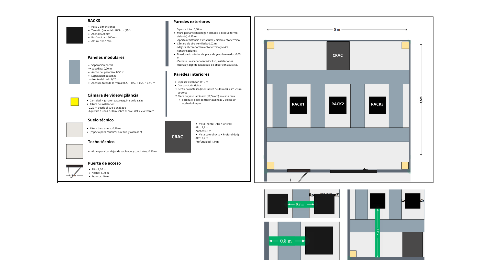

# 1. Propuesta de CPD (Centro de Procesamiento de Datos)

## Ubicación Física
#### Situación física de la sala en el edificio
Se monta el sistema de CPD dentro del propio edificio, en una sala especializada para su mantenimiento y rendimiento estable. ej: alejado de las ventanas y la luz del sol.
Ubicada en “       “

#### Sistemas de climatización
La temperatura se debe mantener entre 18°C – 27°C
La humedad relativa se debe mantener entre el 40% - 60%

Se implanta un esquema de pasillo frío / pasillo caliente:
El aire acondicionado de precisión (CRAC) inyecta aire frío bajo el suelo técnico hacia el pasillo frío.

El aire frío entra por la parte frontal de los racks, enfría los equipos y sale al pasillo caliente por su parte trasera.

El aire caliente del pasillo caliente es succionado por las tomas de retorno del CRAC (mediante rejillas en falso techo o conductos tras la unidad), se enfría y se recircula al pasillo frío.
Beneficios: evita mezcla de corrientes, minimiza puntos calientes y reduce hasta un 30 % el consumo de refrigeración.

#### Medidas para dificultar la identificación de la sala
La sala que alberga los racks y el RACK de servidores se sitúa en el núcleo interior del edificio, lejos de vestíbulos y accesos principales. No tiene ventanas ni puertas acristaladas; en caso de existir una ventanilla, se aplica un film opaco para impedir la visibilidad. Todas las canalizaciones de red y alimentación eléctrica llegan mediante falsos techos y suelos técnicos, de modo que no sea posible reconocer la función de la sala desde el exterior.

El acceso físico está estrictamente solo para personal autorizado, bajo control de cámaras. No se instalan conductos ni ventiladores aparentes: el aire caliente extraído de los pasillos traseros de los racks se canaliza por conductos internos hasta la unidad CRAC.

De este modo, la sala de refrigeración de precisión y los equipos permanecen discretos, discretamente integrados en la infraestructura, cumpliendo requisitos de confidencialidad, seguridad y eficacia térmica.

#### Distribución y gestión del cableado
El objetivo es garantizar una instalación limpia, eficiente, segura y fácilmente escalable, evitando interferencias, sobrecalentamientos o errores humanos.
1. Canalización separada
Eléctrico y datos en trayectorias distintas:

Canaletas eléctricas en canto de falso suelo.

Bandejas de datos en el techo técnico o railes bajo suelo.

Ventaja: minimiza interferencias electromagnéticas y facilita futuras ampliaciones.

2. Etiquetado claro y uniforme
Cada cable lleva etiqueta en ambos extremos con formato:
EJ: srv3 — eth0 — switch1 — port5
Se emplea tipografía legible y película termocontraíble para durabilidad.
Beneficio: agiliza la identificación en incidencias y reduce el riesgo de desconexiones erróneas.
3. Tipos, longitudes y colores
Categoría de cable:
Cat 6a para todos los enlaces de datos (hasta 10 Gbps con margen).

Longitud optimizada:
Evitar cables excesivamente cortos (tensión en conectores) o muy largos (enredos).
Longitud recomendada: 1–3 m en pasillos, 5–7 m para enlaces entre salas.

Código de color en funda o cinta:

Azul → Red de administración
Verde → Red interna entre servidores
Rojo → Tráfico de Internet
Naranja → Backups y almacenamiento

Documentación del cableado
Mapa de red físico y lógico actualizado
Inventario de conexiones con fecha y responsables de la instalación
Tener un cableado ordenado y sin obstáculos mejora la ventilación interna de los racks, ayudando a mantener una temperatura más baja y reduciendo el consumo de energía en refrigeración.

#### Suelo técnico y techo técnico
Debemos optimizar la distribución de cableado, ventilación y accesibilidad del CPD mediante estructuras físicas diseñadas específicamente para entornos de servidores.
Suelo técnico (plenum de aire frío)
Función principal: cámara de distribución de aire frío proveniente de las unidades CRAC hacia el pasillo frío.
Altura del suelo: 0,20 m para canalizar la refrigeración y cableado.
Material: paneles metálicos (aluminio o acero con recubrimiento anti-corrosión) desmontables.
Usos complementarios:
Canalización de cableado de datos (Cat 6a) y fibra, separado de la electricidad.

Pasacables y conductos de alimentación de PDUs desde bandejas superiores.
Ventajas
Flujo controlado de aire frío al frente de los racks.
Acceso rápido al cableado para mantenimiento.
Refuerzo de la estrategia “cold aisle containment”.
Techo técnico (plenum de retorno)
Función principal: rejillas y conductos para extraer el aire caliente del pasillo caliente y conducirlo de vuelta a los CRAC.
Altura libre bajo techo: 0,30 m para bandejas y tuberías.
Material: perfiles metálicos y placas ligeras (aluminio o chapa galvanizada).
Usos complementarios:
Bandejas estructuradas de red y fibra.

Iluminación LED empotrada y sensores de temperatura/humedad.
Ventajas
Evacuación limpia del aire caliente, evitando recirculaciones indeseadas.
Canalización ordenada de cables de red, manteniendo el techo libre de obstáculos.
Integración de detectores y luminarias sin interferir con el flujo de retorno.
La combinación de falso suelo como plenum frío y falso techo como plenum caliente, junto al esquema de pasillos frío / caliente y unidades CRAC, reduce la carga de refrigeración, mejora la eficiencia energética y facilita futuras ampliaciones con mínimo trabajo en obra.

#### Planos, dibujos y diagramas

#### Estructuración de los racks 

## Infraestructura IT 
#### Servidores
#### Patch panels
#### Switches
#### Planos y diagramas

## Infraestructura eléctrica
#### Sistemas de alimentación redundante
#### SAIs

## Seguridad física
#### Elementos de control de acceso a incorporar en el CPD
#### Videovigilancia
#### Sistemas de prevención, detección y extinción de incendios
#### Vías de evacuación
#### Diagramas, planos y fotografías

## Seguridad lógica
#### Restricción de acceso mediante autorización
#### Firewalls
#### Monitorización
#### Copias de seguridad / Backups
#### RAIDs

## Prevención de riesgos laborales 
#### Medidas aplicadas en materia de prevención de riesgos laborales en el CPD

## Sostenibilidad
#### Cómo optimizar el consumo de energía
#### Uso de energía verde en el CPD
#### Ahorro en longitud de cableado
#### Sistemas de circulación de aire que aprovechen condiciones naturales
#### Parada automática de equipos de comunicaciones cuando no haya carga
#### Uso de equipos de bajo consumo energético

## Implementación del CPD en la nube (AWS)
#### Implementación del CPD en Amazon Web Services (AWS)

## Investigación y comparación de eficiencia energética
#### Investigar y comparar la eficiencia energética con otros proveedores de nube
#### Cómo los distintos proveedores ofrecen soluciones de CPD gestionadas por estas empresas
#### Cómo cubren los requerimientos previamente expuestos
