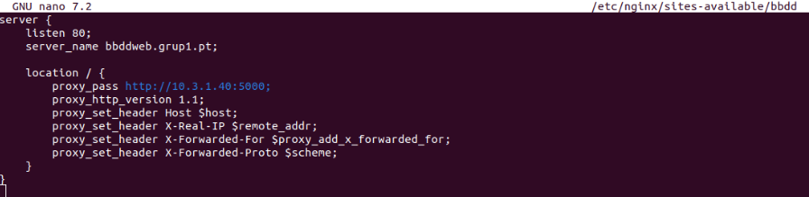
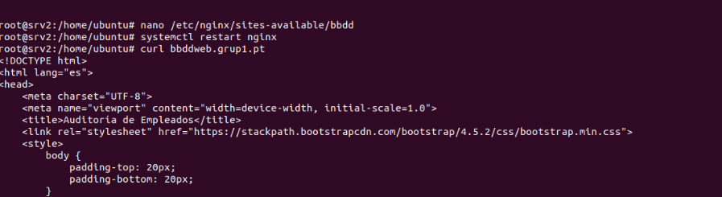

# 2. Implantación de los servicios

## Preparación máquinas
| Name VPC | IP VPC | Subnet | Gateway | Routes | ID Cuenta | ID VPC | Server |
| ----------- | ----------- | ----------- | ----------- | ----------- | ----------- |----------- |----------- |
| VPC-Eduard | 10.2.0.0/16 | 10.2.1.0/24 | IGW-Eduard | RT-Eduard | 884365647459 | vpc-099d2ee5027493805 | srv1 |
| VPC-Alejandro | 10.0.0.0/16 | 10.0.1.0/24 | IGW-Alejandro | RT-Alejandro | 138706074330 | vpc-0d684a2cca2a773db | srv2 |
| VPC-Linyi | 10.1.0.0/16 | 10.1.1.0/24 | IGW-Linyi | RT-Linyi | 058264113592 | vpc-0e802896fad67ad98 | srv3 |
| VPC-Carlos | 10.3.0.0/16 | 10.3.1.0/24 | IGW-Carlos | RT-Carlos | 946111168272 | vpc-069ea527c0d5e8f0e | srv4 |

| Servidor | Servicios | Tipo EC2 |
| ----------- | ----------- | ----------- | 
| 1 | ElasticSearch, Kibana, Nagios | t2.large |
| 2 | Web, Audio, Streaming | t3.small |
| 3 | DNS, FTP | t2.micro |
| 4 | Base de Datos (PGSQL) | t3.small |
| 5 | Copias de Seguridad | t2.micro |

## Configuración de Servidor 1

#### ElasticSearch + Kibana
### Nagios

## Configuración de Servidor 2
Primero se crea una instancia dentro de AWS (Amazon Web Service) que tendrá el sistema operativo Ubuntu Server 24.04 LTS, se asigna t3.small como tipo de instancia dado que nos permitirá gestionar los servidores web, audio y streaming.

Seguidamente, se asigna una IP elástica, que es una dirección IP pública fija que se puede reasignar entre distintos servidores para mantener accesible el servicio incluso si cambia la infraestructura.

Después de la creación de la instancia, se hacen pruebas de conectividad con los otros servidores.

Se cambia el nombre de la instancia.

#### Web (Nginx)
Nginx es un servidor web de alto rendimiento que también puede funcionar como proxy inverso y servidor de medios. Se utiliza para servir páginas web, redirigir tráfico y gestionar transmisiones de audio o vídeo.

Para poder instalar este servicio se debe  de ejecutar el comando “sudo apt install nginx” y “systemctl status nginx” para comprobar su estado.

Se ha creado una carpeta dedicada donde almacenaremos los archivos relacionados con nuestra página principal. Además, se ha instalado la plantilla Massively con “wget”.

Para garantizar la seguridad de nuestra página web, se han generado tres archivos clave utilizando la herramienta OpenSSL. Estos archivos se utilizan para configurar un certificado SSL en nuestro servidor Nginx, asegurando que las comunicaciones con la página sean seguras y cifradas.

Se crea y configura el host virtual dentro del directorio /etc/nginx/sites-available con los siguientes parámetros:

> Al recibir una petición por el puerto 80, redirige automáticamente al puerto 443 (HTTPS), nuestro servidor escucha por todas las interfaces, por ende, se puede ver tanto con su IP privada y pública. Se añaden los certificados creados anteriormente, ruta de archivos, index.html y un return 404 para otros errores. 

> Para acceder a la página web: https://18.204.111.82/

**WEB FTP**

Además de la página anterior, se ha configurado el servicio FTP para poder usarlo a través de nuestra web. 

Se crea un nuevo directorio “ftp” dentro de “/var/www/html/pprincipal” en el cual se añade el archivo descomprimido de monsta_ftp.

Lo más probable es que ocurra el siguiente error:

> “2025-05-21T09:46:43.211693+00:00 srv3 sshd[10412]: Unable to negotiate with 34.234.116.252 port 44862: no matching host key type found. Their offer: ssh-rsa,ssh-dss [preauth]”

Este error significa que el cliente (en la dirección IP 34.234.116.252, puerto 44862) intentó conectarse al servidor, pero no se pudo negociar una conexión SSH porque el cliente ofreció tipos de claves de host (ssh-rsa, ssh-dss) que el servidor no acepta. 

Para solucionar el error, se debe agregar las siguientes 2 líneas dentro del archivo
/etc/ssh/sshd_config

Se modifica nuestro host virtual para poder acceder a la nueva localización /ftp y activar el uso de php-8.3.

Para poder acceder a Monsta FTP, debemos navegar por “http://URLweb/ftp”. Una vez dentro, se puede autentificar el usuario tanto por FTP como SFTP/SCP.

Se crea un host virtual que hará de proxy para poder mostrar una página del servidor 4 que tiene la tablas sobre Auditoría de Empleados por Convenio. Para hacer esto, se debe añadir al archivo de configuración bind9 que contiene las zonas directas un nuevo CNAME para que haga referencia al proxy y poder buscarlo como bbddweb.grup1.pt.

Estos cambios y búsqueda/resolución de nombre solo se pueden ver desde dentro de la red virtual privada.

Se crea un enlace simbólico del fichero “bbdd” que está dentro del directorio /etc/nginx/sites-available/ hasta /etc/nginx/sites-enabled/ para activar el host virtual que actúa como proxy.

#### Audio
#### Streaming

## Configuración de Servidor 3
#### DNS
#### FTP

## Configuración de Servidor 4
#### Base Datos

## Configuración de Servidor 5
#### Copias seguridad

